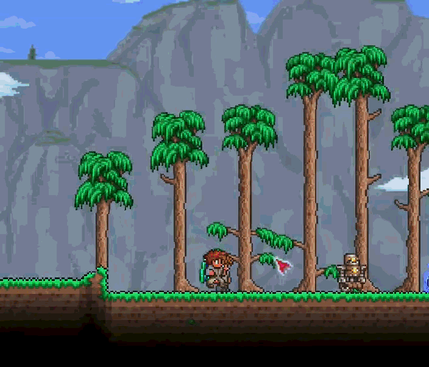

# Souls of Terra

Souls of Terra is a Terraria content mod built around a global soul economy. Hostile creatures release souls, players risk their carried balance on death, and that currency feeds a new progression and crafting system.

## Soul collection

The project is an early prototype. Existing art and balance values are temporary unless a document explicitly says otherwise.

## Development documentation

The files below are internal development notes and may contain major story spoilers:

- [Game design](docs/GAME_DESIGN.md) — intended player experience and long-term direction.
- [Implementation status](docs/IMPLEMENTATION_STATUS.md) — what exists in the current build and what remains incomplete.
- [Design decisions](docs/DECISIONS.md) — decisions already settled and the reasoning behind them.

When the documents disagree with the code, `IMPLEMENTATION_STATUS.md` should describe the code as it currently behaves, while `GAME_DESIGN.md` remains the source of truth for intended behavior.
